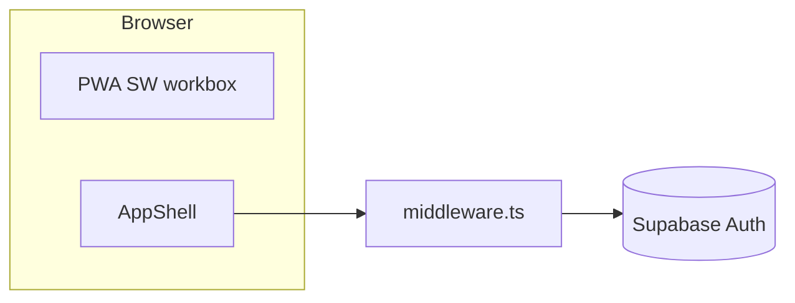

# Karriqi — family app foundation (phase 1)

Production-minded **scaffold only**: app shell, routing, Supabase Auth wiring, PWA baseline, and a small design system. No shopping, todos, calendar, meals, chat, or real notifications.

## Stack

- **Next.js** (App Router) · **TypeScript** · **pnpm**
- **Tailwind CSS v4** · **shadcn/ui** (Base UI primitives) · **lucide-react**
- **Supabase** Auth + SSR (`@supabase/ssr`)
- **PWA** via `@ducanh2912/next-pwa`
- **Forms:** `react-hook-form` + **Zod**
- **Theme:** `next-themes` (dark-first)

## Setup

```bash
pnpm install
cp .env.example .env.local
# Add your Supabase URL and anon key, then:
pnpm dev
```

Open [http://localhost:3000](http://localhost:3000). Protected routes redirect to `/auth/sign-in` when there is no session.

## Scripts

| Command            | Purpose                |
| ------------------ | ---------------------- |
| `pnpm dev`         | Development server     |
| `pnpm build`       | Production build       |
| `pnpm start`       | Run production server  |
| `pnpm lint`        | ESLint                 |
| `pnpm typecheck`   | TypeScript (`noEmit`)  |
| `pnpm format`      | Prettier write         |
| `pnpm format:check`| Prettier check         |

## Environment variables

| Variable                          | Required for auth | Notes                                      |
| --------------------------------- | ----------------- | ------------------------------------------ |
| `NEXT_PUBLIC_SUPABASE_URL`        | Yes               | Project URL                                |
| `NEXT_PUBLIC_SUPABASE_ANON_KEY`   | Yes               | Public anon key (never use service role here) |

Validated lightly in [`lib/env.ts`](lib/env.ts). Without them, protected routes still redirect to sign-in, which shows a “Configure Supabase” card.

## Architecture (short)

- **`app/(main)/`** — Authenticated shell (`AppShell`: header, desktop sidebar, mobile bottom nav). Routes: `/dashboard`, `/shopping`, `/todo`, `/calendar`, `/settings`.
- **`app/auth/`** — Sign-in, sign-up, OAuth/magic-link **`/auth/callback`** handler.
- **`middleware.ts`** — Refreshes Supabase session; guards paths listed in [`config/routes.ts`](config/routes.ts).
- **`config/navigation.ts`** — Single nav config for mobile + desktop.
- **`components/patterns/`** — Page header, section, list placeholder, placeholder module page.
- **`lib/supabase/`** — Browser + server clients; session helper for layouts.
- **`lib/notifications/`** — Types + no-op service; Realtime/push hooks documented for later.
- **`lib/repositories/`** — Placeholder for data access; **`modules/`** for future feature slices.



## PWA

- Manifest: [`public/manifest.webmanifest`](public/manifest.webmanifest)
- Icons: [`public/icons/`](public/icons/) (replace with branded assets)
- Service worker is **disabled in development**; generated under `public/` on `pnpm build`.

## Implemented in phase 1

- Next.js app with linting, Prettier, TypeScript paths (`@/*`)
- Dark-first theming and shadcn/ui primitives used by the shell
- Mobile-first layout: bottom navigation + desktop sidebar
- Placeholder pages for all routes in the spec
- Supabase client/server helpers, middleware session refresh, protected routes
- Minimal sign-in / sign-up forms (`react-hook-form` + Zod)
- PWA manifest + installability baseline
- Notification **contracts** and README map (no realtime, no push)

## Intentionally deferred (phase 2+)

- Domain features (shopping lists, todos, calendar events, meals, etc.)
- Profiles / households tables (add when a module needs RLS or shared identity)
- In-app notification feed and Supabase Realtime subscriptions
- Web Push, VAPID, and Edge Function send path
- Rich settings and roles

## Phase 2 suggestion (Shopping)

1. Add Supabase tables + RLS for lists/items.
2. Generate types: `supabase gen types typescript` into `types/`.
3. Implement `lib/repositories/shopping-repository.ts` and a `modules/shopping` entry component.
4. Swap [`app/(main)/shopping/page.tsx`](app/(main)/shopping/page.tsx) to render the real module root — keep `AppShell` and `config/navigation` unchanged.

## Extra decisions

- **Next.js 16** was installed by `create-next-app@latest` (plan assumed 15; no downgrade needed).
- **No `profiles` table** yet — Auth JWT is enough until relational data is required.
- **Tailwind 4 + shadcn “base”** stack from current CLI defaults.
