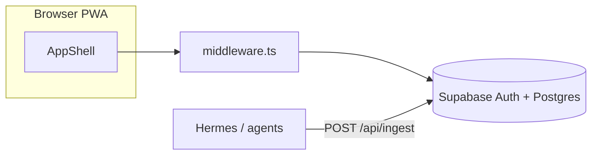

# Karriqi

**Mobile-first family hub** — one private PWA for household shopping, tasks, calendar, notifications, and agent-curated weekend ideas.

**Product context (read first):** [`doc/project-context.md`](./doc/project-context.md) — goal, modules, principles, and what to keep in sync when you change the app.

**Technical deep dive:** [`doc/`](./doc/README.md) (architecture, auth, dev setup, PWA, notifications, roadmap).

## What’s built

| Area | Summary |
| --- | --- |
| **App shell** | Authenticated layout — mobile bottom nav, desktop sidebar, dark-first theme, PWA install |
| **Dashboard** | Weekend activity options from agent ingest (operator entries) |
| **Shopping** | Shared household staples, list, purchases; Albanian default catalog |
| **Kanban** | Family tasks — assignees, priority, tags, attachments |
| **Calendar** | Shared household events |
| **Settings** | Profile, household members, PIN sign-in, Web Push |
| **Ingest API** | OpenAPI contract at `/openapi.json`; Hermes and agents push via `/api/ingest/*` |
| **Notifications** | In-app records + Web Push to household peers |
| **Auth** | Supabase (email + PIN); no public sign-up |

## Stack

- **Next.js** (App Router) · **TypeScript** · **pnpm**
- **Tailwind CSS v4** · **shadcn/ui** (Base UI) · **lucide-react**
- **Supabase** Auth + Postgres (RLS) · SSR (`@supabase/ssr`)
- **PWA** via `@ducanh2912/next-pwa` · **Web Push** (VAPID)
- **Forms:** `react-hook-form` + **Zod**
- **Deploy:** Cloudflare Workers (OpenNext) — see [`CLOUDFLARE.md`](./CLOUDFLARE.md)

## Setup

```bash
pnpm install
cp .env.example .env.local
pnpm setup:local-host   # once
# Add your Supabase URL and anon key, then:
pnpm dev
```

**Dev URL:** [http://karriqi.test](http://karriqi.test) — run **`pnpm setup:local-host`** once (Herd nginx proxy → Next.js :3010), restart Herd, then **`pnpm dev`** from the **primary checkout**. Use **`http://`** (not `https://`). Do **not** use `.dev` locally — browsers force HTTPS on `.dev` (HSTS).

**Worktrees:** use **`pnpm worktree:dev`** — each gets `http://localhost:<port>` on the first free port in 3010–3019.

Add **`http://karriqi.test`** (and worktree origins if needed) under **Supabase → Authentication → URL configuration** for redirects/OAuth.

**Secrets:** copy `.env.example` to `.env.local` and put real keys only in `.env.local` (never commit `.env.local`). The example file must stay placeholder-only.

Protected routes redirect to `/auth/sign-in` when there is no session.

## Scripts

| Command                  | Purpose                                      |
| ------------------------ | -------------------------------------------- |
| `pnpm setup:local-host`  | One-time Herd nginx proxy for karriqi.test |
| `pnpm dev`               | Primary checkout dev server (karriqi.test)   |
| `pnpm worktree:dev`      | Worktree dev server (localhost port)         |
| `pnpm build`             | Production build                             |
| `pnpm start`             | Run production server                        |
| `pnpm lint`              | ESLint                                       |
| `pnpm typecheck`         | TypeScript (`noEmit`)                        |
| `pnpm test`              | Vitest                                       |
| `pnpm format`            | Prettier write                               |
| `pnpm format:check`      | Prettier check                               |

## Environment variables

| Variable                        | Required for auth | Notes                                         |
| ------------------------------- | ----------------- | --------------------------------------------- |
| `NEXT_PUBLIC_SUPABASE_URL`      | Yes               | Project URL                                   |
| `NEXT_PUBLIC_SUPABASE_ANON_KEY` | Yes               | Public anon key (never use service role here) |

Additional server-only vars (ingest token, VAPID, service role, PIN pepper): see `.env.example` and [`CLOUDFLARE.md`](./CLOUDFLARE.md).

Validated lightly in [`lib/env.ts`](lib/env.ts). Without Supabase config, protected routes still redirect to sign-in, which shows a “Configure Supabase” card.

## Architecture (short)

- **`app/(main)/`** — Authenticated shell (`AppShell`: header, desktop sidebar, mobile bottom nav). Routes: `/dashboard`, `/shopping`, `/kanban`, `/calendar`, `/settings`.
- **`app/auth/`** — Sign-in (email/password + PIN); **`/auth/sign-up`** redirects to sign-in. OAuth/magic-link **`/auth/callback`** handler.
- **`middleware.ts`** — Refreshes Supabase session; guards paths in [`config/routes.ts`](config/routes.ts).
- **`config/navigation.ts`** — Single nav config for mobile + desktop.
- **`lib/repositories/`** — Supabase data access; **`modules/`** — ingest schemas, operator payloads, feature slices.
- **`modules/ingest/`** — OpenAPI + Zod contract for external agents.


```mermaid
flowchart LR
  subgraph client [Browser PWA]
    Shell[AppShell]
  end
  MW[middleware.ts]
  SB[(Supabase Auth + Postgres)]
  Agents[Hermes / agents]
  Shell --> MW
  MW --> SB
  Agents -->|POST /api/ingest| SB
```

Living architecture diagram (maintainer): `/dev/architecture`.

## PWA

- Manifest: [`public/manifest.webmanifest`](public/manifest.webmanifest)
- Icons: [`public/icons/`](public/icons/)
- Service worker is **disabled in development**; generated under `public/` on `pnpm build`.
