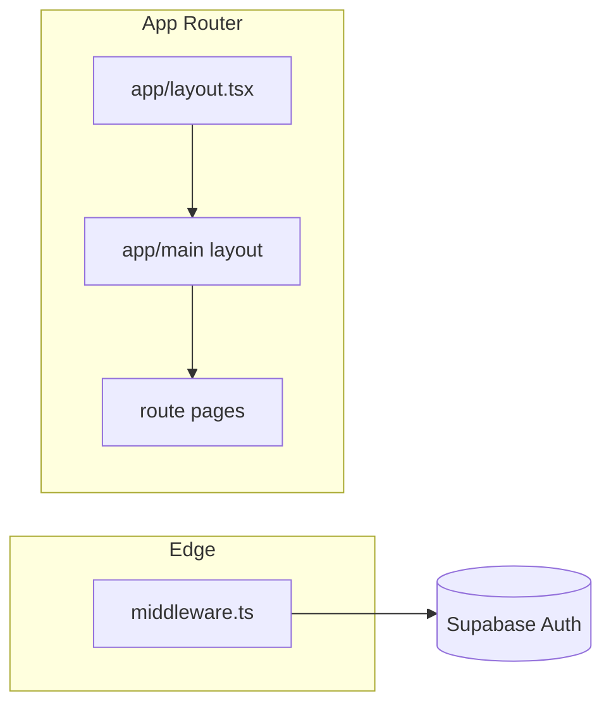

# Architecture

## Product intent

**Karriqi** is a **mobile-first family hub**: one shell (header, nav) with modules such as shopping, todos, and calendar. **Phase 1** implements only the **shell**, **auth wiring**, **PWA baseline**, and **placeholder routes** — no real feature data or business logic.

## Stack (locked for phase 1)

| Layer           | Choice                                                                   |
| --------------- | ------------------------------------------------------------------------ |
| Framework       | Next.js 16 (App Router), TypeScript                                      |
| Package manager | pnpm                                                                     |
| UI              | React 19, Tailwind CSS 4, shadcn/ui (Base UI primitives), `lucide-react` |
| Forms           | `react-hook-form`, `@hookform/resolvers`, Zod 4                          |
| Backend (auth)  | Supabase Auth via `@supabase/supabase-js` + `@supabase/ssr`              |
| Theme           | `next-themes`, dark-first, `class` on `<html>`                           |
| PWA             | `@ducanh2912/next-pwa` (webpack integration)                             |

## High-level request flow

1. **Browser** loads a route under `app/`.
2. **`middleware.ts`** runs first (see [authentication-and-security.md](./authentication-and-security.md)): refreshes the Supabase session cookie and redirects unauthenticated users away from protected paths.
3. **Layouts** compose the UI: root layout (fonts, theme, toasts); `(main)` layout wraps authenticated pages in **`AppShell`** (sidebar + bottom nav + header).
4. **Server Components** read the session with **`getSessionUser()`** from [`lib/supabase/server.ts`](../lib/supabase/server.ts) where needed; **client** code uses [`lib/supabase/client.ts`](../lib/supabase/client.ts).

## Route map

| URL                                                          | Layout                | Purpose                                                         |
| ------------------------------------------------------------ | --------------------- | --------------------------------------------------------------- |
| `/`                                                          | Root only             | Marketing-style landing; sign-in CTA                            |
| `/dashboard`, `/shopping`, `/todo`, `/calendar`, `/settings` | `(main)` + `AppShell` | Placeholder module screens (phase 2+ replace content)           |
| `/auth/sign-in`                                              | `app/auth/layout.tsx` | Email/password sign-in                                          |
| `/auth/sign-up`                                              | Same                  | **Redirects to** `/auth/sign-in` (no self-service registration) |
| `/auth/callback`                                             | Route handler         | OAuth / magic-link code exchange (scaffold for later)           |

Protected prefixes are defined in [`config/routes.ts`](../config/routes.ts) (`PROTECTED_ROUTE_PREFIXES`).

## Folder reference

| Path                          | Role                                                                    |
| ----------------------------- | ----------------------------------------------------------------------- |
| `app/`                        | Routes, global CSS, root metadata                                       |
| `app/(main)/`                 | Authenticated shell group (URLs unchanged)                              |
| `components/layout/`          | `AppShell`, header, nav, page container, user menu                      |
| `components/patterns/`        | Reusable page patterns (`PlaceholderPage`, `PageHeader`, etc.)          |
| `components/ui/`              | shadcn primitives                                                       |
| `components/providers/`       | Theme + Sonner toaster                                                  |
| `components/auth/`            | Sign-in form, “configure Supabase” card                                 |
| `config/routes.ts`            | Path constants + `isProtectedPath()`                                    |
| `config/navigation.ts`        | Single source for nav items (mobile + desktop)                          |
| `lib/supabase/`               | Browser client, server client, middleware session helper                |
| `lib/env.ts`                  | Public env parsing / `isSupabaseConfigured()`                           |
| `lib/notifications/`          | Types + no-op service (phase 2+)                                        |
| `lib/repositories/`           | Intended home for Supabase data access                                  |
| `lib/push/`                   | Notes for future web push                                               |
| `hooks/`                      | e.g. `use-notification-subscription` stub                               |
| `modules/`                    | Intended home for vertical slices (`shopping`, etc.) — empty in phase 1 |
| `types/database.ts`           | Placeholder `Database` type until `supabase gen types`                  |
| `public/manifest.webmanifest` | PWA manifest                                                            |
| `public/icons/`               | Placeholder PNGs (replace with brand assets)                            |
| `middleware.ts`               | Session refresh + auth gating                                           |

## Design system (lightweight)

- **Tokens:** CSS variables in [`app/globals.css`](../app/globals.css) (shadcn convention: `background`, `foreground`, `card`, `radius`, etc.).
- **Patterns:** Prefer `components/patterns/*` + `components/ui/*` over one-off styles.
- **Navigation:** Always update [`config/navigation.ts`](../config/navigation.ts) so mobile bottom nav and desktop sidebar stay in sync.

## Extension points (phase 2+)

1. Add **`lib/repositories/<feature>.ts`** for Supabase queries.
2. Add **`modules/<feature>/`** for domain UI and types.
3. Swap a **`app/(main)/<route>/page.tsx`** body to import a module entry component; keep `AppShell` and nav config stable.
4. When tables exist, generate **`Database`** types and wire RLS in Supabase.
